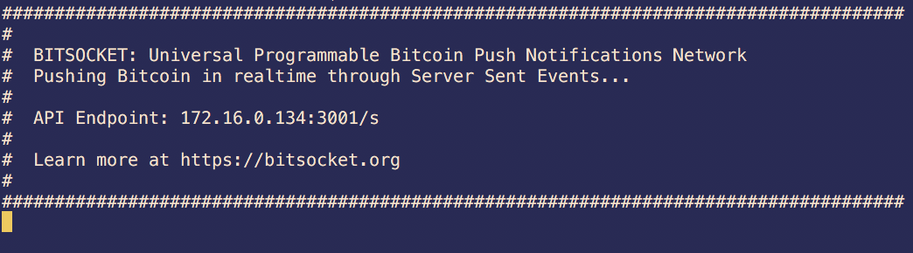
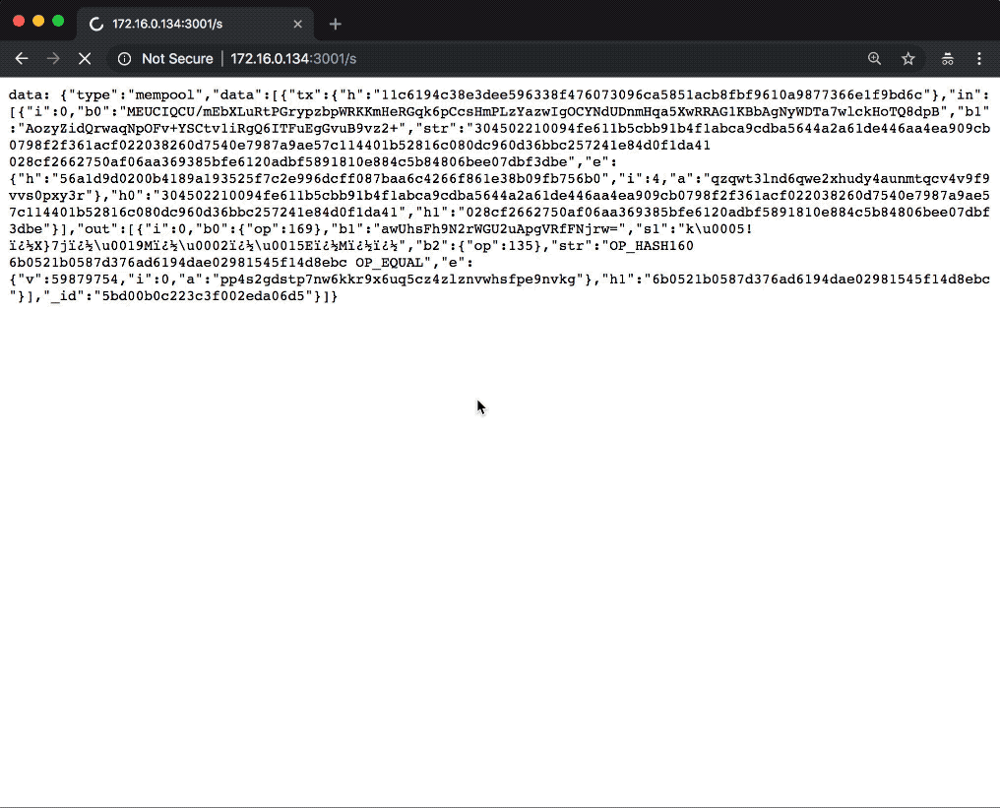

# rvnsocketd

message bus for ravencoin

# Prerequisites

rvnsocketd has a dependency on rvndb.

[Install rvnd](https://docs.bitdb.network/docs/install)

# Install

```
npm install --save rvnsocketd
```

# Usage

## 1. Basic

If you already have RvnDB running on port 22879, you can simply do this:

```
const rvnsocketd = require('rvnsocketd')
rvnsocketd.init()
```

You will see a screen like this:



Now open your browser to the socket URL and you'll see SSE pouring in.



That's the raw firehose. You probably don't want to consume the whole thing, so make sure to add a rvnquery filter. Learn more at [https://bitsocket.org/docs](https://bitsocket.org/docs)

## 2. Custom RvnDB node

You can specify the Zeromq subscriber from a rvndb node, like this:

```
const rvnsocketd = require('rvnsocketd')
rvnsocketd.init({
  rvn: { host: "127.0.0.1", port: 28769 },
})
```

By default Rvndb's zeromq publisher broadcasts to [port 28769](https://github.com/21centurymotorcompany/bitd/blob/master/config.js#L44), but you can customize if you want.


## 3. Custom SSE port

By default, the SSE port is automatically 3001. You can customize this:

```
const rvnsocketd = require('rvnsocketd')
rvnsocketd.init({
  socket: { port: 3001 }
})
```

## 4. Use an existing express.js server

```
// Step 1. express.js web server init
const express = require("express")
const app = express()
app.listen(3000 , function () {
  console.log("web server listening at " + port)
})

// Step 2. pass the express server to rvnsocketd
const rvnsocketd = require('rvnsocketd')
rvnsocketd.init({
  socket: { app: app }
})
```
